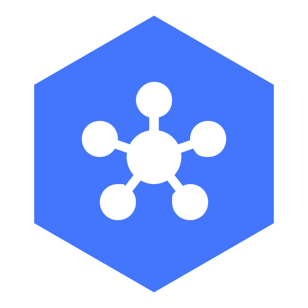
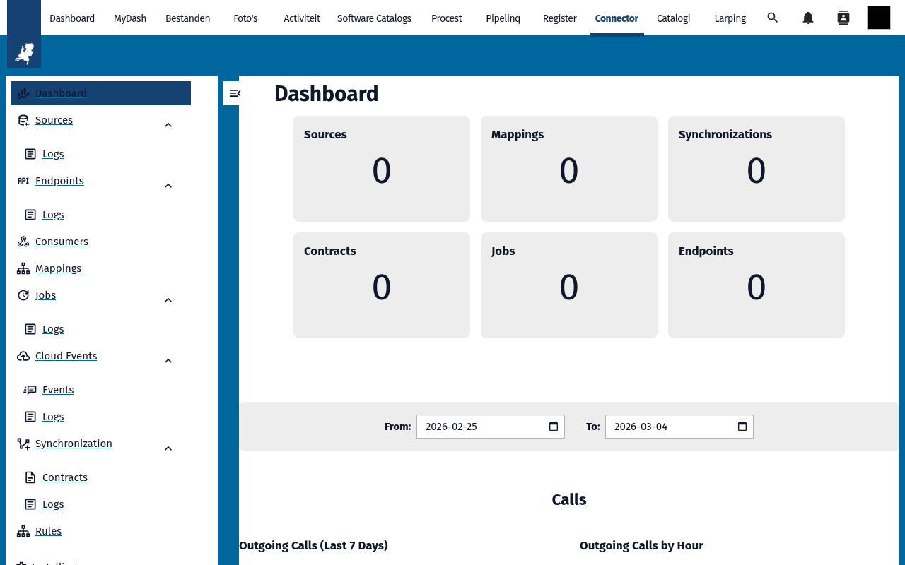
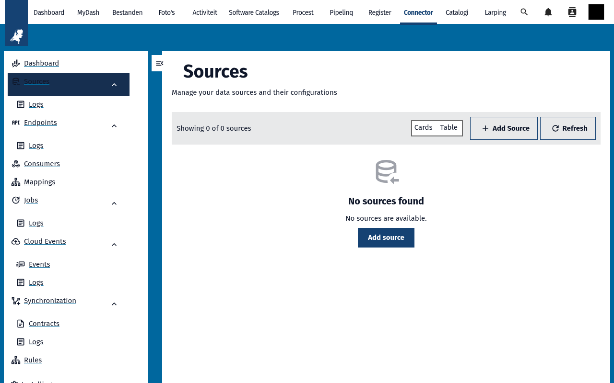
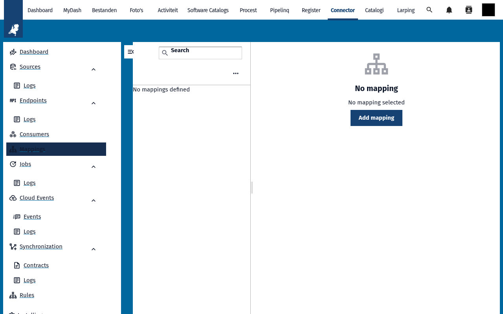
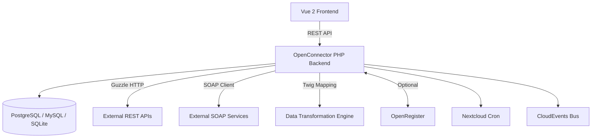

<p align="center">
  
</p>

<h1 align="center">OpenConnector</h1>

<p align="center">
  <strong>API gateway and integration hub for Nextcloud — connect, transform, and synchronize data between systems</strong>
</p>

<p align="center">
  <a href="https://github.com/ConductionNL/openconnector/releases"></a>
  <a href="https://github.com/ConductionNL/openconnector/blob/main/LICENSE"></a>
  <a href="https://github.com/ConductionNL/openconnector/actions"></a>
  <a href="https://conductionnl.github.io/openconnector/"></a>
</p>

---

OpenConnector brings enterprise service bus (ESB) capabilities natively into Nextcloud. Define external API connections as sources, expose your own API endpoints, transform data with flexible mappings, and keep systems in sync through scheduled or event-driven synchronizations — all from within your Nextcloud instance. It supports REST, SOAP, and XML APIs with OAuth, JWT, and API key authentication out of the box.

OpenConnector is a fully standalone app. It does not require OpenRegister or any other Conduction app to function, though it integrates seamlessly with OpenRegister when both are installed.

## Screenshots

<table>
  <tr>
    <td></td>
    <td></td>
    <td></td>
  </tr>
  <tr>
    <td align="center"><em>Dashboard</em></td>
    <td align="center"><em>Sources</em></td>
    <td align="center"><em>Mappings</em></td>
  </tr>
</table>

## Features

### Sources (External API Connections)
- **Multiple API Types** — Connect to REST, SOAP, and XML-based APIs with a unified configuration model
- **Authentication** — Built-in support for OAuth 2.0 (client credentials and password grants), JWT Bearer tokens, API keys, and HTTP Basic authentication
- **Dynamic Credentials** — Twig-based token rendering with automatic refresh for OAuth and JWT flows
- **Request Configuration** — Full control over headers, query parameters, pagination, and request options via Guzzle
- **Microsoft Integration** — Custom JWT assertion support for Azure AD / Microsoft Graph authentication

### Endpoints (Exposing APIs)
- **Reverse Proxy** — Expose external APIs through Nextcloud-hosted endpoint paths
- **Per-Method Definitions** — Separate endpoint configurations for GET, POST, PUT, DELETE on the same path
- **Path Parameters** — Dynamic URL segments with placeholder support for single-item and nested resource access
- **Rule Chaining** — Attach ordered rules to endpoints for authentication, mapping, synchronization, and file handling
- **Public or Secured** — Endpoints can be publicly accessible or protected with JWT, OAuth, API key, or Basic authentication

### Mapping (Data Transformation)
- **Field Mapping** — Direct one-to-one, renaming, type conversion, and format adjustment between source and target schemas
- **Twig Templating** — Use Twig expressions for complex transformations including loops, conditionals, and string manipulation
- **Type Casting** — Built-in casts such as jsonToArray for converting embedded JSON strings to structured objects
- **Nested Object Mapping** — Handle deeply nested data structures with dot-notation paths
- **Conditional Mapping** — Apply transformations based on JSON Logic conditions

### Synchronization (Data Sync Between Systems)
- **Source-to-Target Sync** — Define complete synchronization flows with source configuration, target configuration, and data mapping
- **Change Detection** — Hash-based comparison to skip unchanged objects and avoid unnecessary API calls
- **Synchronization Contracts** — Per-object state tracking with origin ID, target ID, and hash storage for reliable incremental sync
- **Pagination Handling** — Automatic pagination traversal with configurable query parameters and result position detection
- **Sub-Object Support** — Synchronize related and nested objects without duplication, with contract-level tracking
- **Force and Test Modes** — Override change detection or run in test mode for validation before production sync
- **XML Support** — Automatic XML-to-JSON parsing with attribute preservation for XML-based data sources

### Rules (Endpoint Logic)
- **Authentication Rules** — Enforce Basic, JWT, ZGW-JWT, OAuth, or API key authentication on any endpoint
- **Synchronization Rules** — Trigger a synchronization run when an endpoint is called
- **Download and Upload Rules** — Handle file access, retrieval, uploads, partial/chunked uploads with size and type restrictions
- **Locking Rules** — Exclusive access control with configurable timeout for resource locking
- **Audit Trail Rules** — Access and expose object change history through endpoints
- **JSON Logic Conditions** — Conditionally execute rules based on request body, parameters, headers, path, and method

### Jobs and Scheduling
- **Scheduled Execution** — Cron-based job scheduling for automated synchronization runs
- **Job Logging** — Full execution history with status tracking and error details
- **Log Cleanup** — Automatic cleanup of old log entries to manage storage

### Events and Webhooks
- **Cloud Events** — Emit and consume CloudEvents for real-time, event-driven data flows
- **Event Subscriptions** — Subscribe to events with configurable handlers
- **Consumers** — Define event consumers that process incoming webhook payloads

### Logging and Monitoring
- **Call Logging** — Complete HTTP request/response logging for all source interactions
- **Synchronization Logging** — Per-sync and per-contract log entries with error tracking
- **Rate Limit Detection** — Automatic detection of rate limiting with backoff handling

### Configuration Management
- **Configuration Groups** — Bundle related sources, endpoints, mappings, rules, jobs, and synchronizations into named configurations
- **Import/Export** — Export configurations as OpenAPI-structured JSON for backup, sharing, and environment migration
- **Slug-Based References** — URL-friendly identifiers for all entities

## Architecture



### Data Model

| Entity | Description | Purpose |
|--------|-------------|---------|
| Source | External API connection | Stores base URL, authentication, headers, and request configuration |
| Endpoint | Exposed API path | Reverse-proxy route with method, target type, and attached rules |
| Mapping | Data transformation | Field mapping with Twig templates and type casts |
| Synchronization | Sync flow definition | Links source, target, and mapping with pagination and conditions |
| SynchronizationContract | Per-object sync state | Tracks origin/target IDs, hashes, and last-checked timestamps |
| Rule | Endpoint logic | Authentication, sync triggers, file handling, locking, and audit rules |
| Job | Scheduled task | Cron-based execution of synchronizations with logging |
| Consumer | Event handler | Processes incoming webhook and event payloads |
| Event | Event definition | Cloud event configuration for event-driven processing |
| EventSubscription | Event listener | Subscribes to specific events with handler configuration |
| CallLog | HTTP log | Records request/response details for source interactions |

### Directory Structure

```
openconnector/
├── appinfo/           # Nextcloud app manifest, routes, navigation
├── lib/               # PHP backend
│   ├── Action/        # Action handlers
│   ├── Controller/    # REST API controllers (sources, endpoints, mappings, etc.)
│   ├── Cron/          # Background jobs (sync scheduling, log cleanup)
│   ├── Db/            # ORM entities and mappers
│   ├── EventListener/ # Nextcloud event listeners
│   ├── Http/          # HTTP utilities
│   ├── Migration/     # Database migrations
│   ├── Service/       # Business logic (call, mapping, sync, auth, SOAP, etc.)
│   ├── Settings/      # Admin settings panel
│   └── Twig/          # Twig template extensions
├── src/               # Vue 2 frontend
│   ├── Consumer/      # Consumer management views
│   ├── Endpoint/      # Endpoint configuration views
│   ├── Mapping/       # Mapping editor views
│   ├── Source/        # Source connection views
│   ├── Synchronization/ # Sync management views
│   ├── Job/           # Job scheduling views
│   ├── Webhook/       # Webhook configuration views
│   ├── dashboard/     # Dashboard overview
│   ├── event/         # Event management views
│   ├── rule/          # Rule configuration views
│   └── settings/      # Settings views
├── docs/              # Feature documentation and diagrams
├── docusaurus/        # Documentation website source (Docusaurus)
├── img/               # App icons and screenshots
└── l10n/              # Translations
```

## Requirements

| Dependency | Version |
|-----------|---------|
| Nextcloud | 28 -- 33 |
| PHP | 8.1+ |
| Database | PostgreSQL, MySQL 8.0+, or SQLite |

No additional Nextcloud apps are required. OpenConnector works as a standalone application.

## Installation

### From the Nextcloud App Store

1. Go to **Apps** in your Nextcloud instance
2. Search for **OpenConnector**
3. Click **Download and enable**

### From Source

```bash
cd /var/www/html/custom_apps
git clone https://github.com/ConductionNL/openconnector.git
cd openconnector
composer install --no-dev
npm install
npm run build
php occ app:enable openconnector
```

## Development

### Start the environment

```bash
docker compose -f openregister/docker-compose.yml up -d
```

### Frontend development

```bash
cd openconnector
npm install
npm run dev        # Development build
npm run watch      # Watch mode with live reload
npm run build      # Production build
```

### Code quality

```bash
# PHP
composer phpcs          # Check coding standards
composer cs:fix         # Auto-fix PHPCS issues
composer phpmd          # Mess detection
composer phpmetrics     # HTML metrics report
composer psalm          # Static analysis
composer phpstan        # PHPStan analysis
composer check:strict   # Run all checks (lint, phpcs, phpmd, psalm, phpstan, tests)

# Frontend
npm run lint            # ESLint
npm run stylelint       # CSS/SCSS linting
npm run test            # Jest unit tests
```

## Tech Stack

| Layer | Technology |
|-------|-----------|
| Frontend | Vue 2.7, Pinia, @nextcloud/vue, CodeMirror 6 |
| Build | Webpack 5, @nextcloud/webpack-vue-config |
| Backend | PHP 8.1+, Nextcloud App Framework |
| HTTP Client | Guzzle 7 |
| Templating | Twig 3 (data mapping expressions) |
| SOAP | php-soap/ext-soap-engine, php-soap/psr18-transport |
| Authentication | web-token/jwt-framework (JWT/JWE/JWK) |
| Logic | jwadhams/json-logic-php (conditional rules) |
| Async | ReactPHP (parallel page fetching) |
| Data | PostgreSQL, MySQL 8.0+, or SQLite |
| Quality | PHPCS, PHPMD, phpmetrics, Psalm, PHPStan, ESLint, Stylelint, Jest |

## Support

For support, contact us at [support@conduction.nl](mailto:support@conduction.nl).

For a Service Level Agreement (SLA), contact [sales@conduction.nl](mailto:sales@conduction.nl).

## Documentation

Full documentation is available at **[conductionnl.github.io/openconnector](https://conductionnl.github.io/openconnector/)**

| Page | Description |
|------|-------------|
| [Introduction](docs/intro.md) | Overview of OpenConnector and its components |
| [Sources](docs/sources.md) | Configuring external API connections and authentication |
| [Synchronization](docs/synchronization.md) | Setting up data sync flows with contracts and change detection |
| [Mappings](docs/tutorial/mappings.md) | Data transformation with field mapping and Twig templates |
| [Endpoints](docs/tutorial/endpoints.md) | Exposing APIs through Nextcloud with rules and authentication |
| [Rules](docs/rules.md) | Endpoint logic: auth, sync triggers, file handling, locking |
| [Configurations](docs/configurations.md) | Grouping and exporting entity configurations |
| [Security](docs/security-best-practices.md) | Security best practices and authentication patterns |
| [User API](docs/user-api.md) | User management and authentication API reference |

## Standards & Compliance

- **API standard:** OpenAPI Specification (OAS) for configuration export
- **Event standard:** CloudEvents for event-driven integration
- **Authentication:** OAuth 2.0, JWT (RFC 7519), ZGW JWT, API keys
- **Dutch interoperability:** ZGW APIs (Zaakgericht Werken), Common Ground
- **Accessibility:** WCAG AA (Dutch government requirement)
- **Localization:** English and Dutch

## Related Apps

- **[OpenRegister](https://github.com/ConductionNL/openregister)** -- Object storage layer (optional; used as sync target when installed)
- **[OpenCatalogi](https://github.com/ConductionNL/opencatalogi)** -- Publication and catalog management
- **[DocuDesk](https://github.com/ConductionNL/docudesk)** -- Document generation
- **[NL Design](https://github.com/ConductionNL/nldesign)** -- Design token theming for government compliance

## License

EUPL-1.2

## Authors

Built by [Conduction](https://conduction.nl) -- open-source software for Dutch government and public sector organizations.
