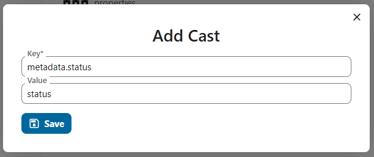
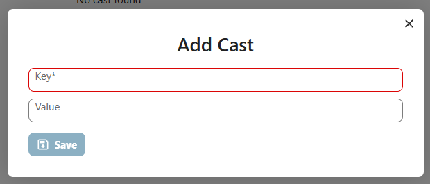
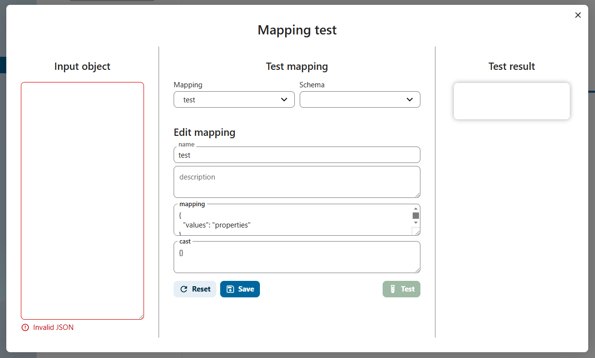

# Mapping

The mapping service transforms the structure of objects, ensuring data from a source aligns with the desired data model. Mapping operates through a series of rules in a `To <- From`-format. These rules can rearrange, transform, or remove values to meet the requirements of a target system.

**Index**

1. [Defining a mapping](mapping.md#defining-a-mapping)
2. [Usage](mapping.md#usage)
3. [Advanced (Twig) mapping and/or adding key's](mapping.md#advanced-twig-mapping-andor-adding-keys)
4. [Pass Through and/or dropping key's](mapping.md#pass-through-andor-dropping-keys)
5. [Working with conditional data](mapping.md#working-with-conditional-data)
6. [Sub mappings](mapping.md#sub-mappings)
7. [Casting (Forcing) the type/format of values](mapping.md#casting-forcing-the-typeformat-of-values)
8. [Translating values](mapping.md#translating-values)
9. [Renaming Keys](mapping.md#renaming-keys)
10. [Order of mapping](mapping.md#order-of-mappingv)
11. [What if I can't map?](mapping.md#what-if-i-cant-map)

## Defining a mapping

Mappings are stored, imported, and exported as JSON objects. Below is an example of a mapping object:

```json
{
  "title": "MyMapping",
  "description": "MyMapping",
  "$id": "https://development.zaaksysteem.nl/mapping/xxllnc.XxllncCaseToZGWZaak.mapping.json",
  "$schema": "https://docs.commongateway.nl/schemas/Mapping.schema.json",
  "version": "0.0.1",
  "passTrough": false,
  "mapping": {
    "{{to_key}}": "{{from_key}}"
  },
  "unset": ["{{from_key}}"],
  "cast": {
    "{{to_key}}":"{{type}}"
  }
}

```

 


## Mapping Object Specifications

Mapping objects MUST follow the specifications below 

| Property    | Required | Usage                                                                                                       | Allowed Value                                                                                                                          |
| ----------- | -------- | ----------------------------------------------------------------------------------------------------------- | -------------------------------------------------------------------------------------------------------------------------------------- |
| title       | Yes      | Short description of the mapping for identification.                                                        | string, max 255 characters                                                                                                             |
| description | No       | Detailed description of the mapping’s purpose.                                                              | string, max 2555 characters                                                                                                            |
| $id         | No       | Unique identifier for the mapping, used for import/export.                                                  | string, max 255 characters                                                                                                             |
| $schema     | Yes      | Declares the object as a mapping.                                                                           | Always: 'https://docs.commongateway.nl/schemas/Mapping.schema.json'                                                                    |
| version     | no       | Versioning to track mapping updates.                                                                         | A valid [semantic version number](https://semver.org/lang/nl/)                                                                        |
| passTrough  | no       | If `true`, all original properties are copied into the new object unless explicitly mapped.                 | A boolean, default to false                                                                                                            |
| mapping     | no       | Defines how properties should be rearranged, using dot notation.                                            | An array where the key is the new property location(in [dot notation](https://grasshopper.app/glossary/data-types/object-dot-notation/)) and the value the current property location (in [dot notation](https://grasshopper.app/glossary/data-types/object-dot-notation/)) |
| unset       | no       | Unset unused properties                                                                                     | A valid json object, read [more](mapping.md) about using unset                                                                         |
| cast        | no       | Forces properties to specific types.                                                                         | Object where the key is the property and the value is the type (e.g., { "age": "integer" }). Supported types: string, boolean, integer, float, etc.                              |

## Usage

Mappings are commonly used to transform objects from a source system into a new structure. Let’s look at an example from the ([petstore](https://petstore.swagger.io/#/pet/findPetsByStatus)) :

Original Object:

```json
{
  "id":123",
  "name":"doggie",
  "status": "available"
}
```

Target Object:

```json
{
  "id":"123",
  "name":"doggie",
  "metadata":{
    "status": "available"
  }
}
```

Mapping Definition:

```json
{
  "title": "Basic Mapping",
  "$schema": "https://docs.commongateway.nl/schemas/Mapping.schema.json",
  "mapping": {
    "id": "id",
    "name": "name",
    "metadata.status": "status"
  }
}
```

Under the hood, the mapping moves values from the From position (status) to the To position (metadata.status). This transformation ensures the object aligns with the target system's structure.

## Furthermore

Rules are carried out as a `To <- From` pair. In this case, the `metadata.status` key has a `status` value. When interpreting what the description is, the mapping service has two options:

* The value is either a dot notation array pointing to another position in the object (see [dot notation](https://grasshopper.app/glossary/data-types/object-dot-notation/)). If so, then the value of that position is copied to the new position. (Under the hood the gateway uses [PHP dot notation to](https://github.com/adbario/php-dot-notation) achieve this result)
* The value is not a dot notation array to another position in the object (see dot notation), then the value is rendered as a [twig](https://twig.symfony.com/) template.

> **Note**
>
> * The key is ALWAYS treated as a dot notation telling the service where to move the properties content to.
> * Mapping object MUST have a title and $schema definition, and SHOULD have a description.
> * It is not necessary to declare every step of the array (e.g. metadata, metadata.status, metadata.status.name) just declaring the property where you want it will create the in between array key’s



Keep in mind that dot notations have no maximum depth, so an original object like:

```json
{
  "id":"0d671e30-04af-479a-926a-5e7044484171",
  "name":"doggie",
  "status": "available"
}
```

Could be mapped like:

```json
{
  "title": "A simple mapping",
  "$schema": "https://docs.commongateway.nl/schemas/Mapping.schema.json",
  "mapping": {
    "id": "id",
    "name": "name",
    "metadata.status.name": "status"
  }
}
```

To a new object:

```json
{
  "id":"0d671e30-04af-479a-926a-5e7044484171",
  "name":"doggie",
  "metadata":{
    "status":{
      "name": "available"
    }
  }
}
```

> **Note**
>
> * Using dot notation to move values around within an object will NOT cause the value to change or be converted. In other words you can move an entire array or sub object around by simply moving the property that it is in. Also, booleans will remain booleans, integers remain integers etc.
> * In the case that a key has a dot in it, and you don’t want it to trigger the array pointing with dot notation you can use the ASCII code for a dot instead. Example: “location.first.name” if you want first.name to be a string (just to show what I mean: “location.’first.name’”) it is possible to do this: “location.first.name”. For more options like this, see: https://www.freeformatter.com/html-entities.html.

## Advanced (Twig) mapping and/or adding key's

Another means of mapping is Twig mapping. Let's look at a more complex mapping example to transform or map out data. The petstore decided that we would like to assign pets to an aisle, there are three aisle (green, blue and red) and every pet needs to be assigned randomly. That means that we need business logic in our mapping. fortunately we can use [twig](https://twig.symfony.com/doc/2.x/) logic in our mapping by placing it in \{{\}} braces. that means that we can do this in our mapping

```json
{
  "name": "A simple mapping",
  "$schema": "https://docs.commongateway.nl/schemas/Mapping.schema.json",
  "mapping": {
    "id": "id",
    "name": "name",
    "status": "status",
    "aisle": "{{ random([green, blue , red]) }}"
  }
}
```

To turn this orignal object:

```json
{
  "id":"0d671e30-04af-479a-926a-5e7044484171",
  "name":"doggie",
  "status": "available"
}
```

Into this new object:

```json
{
  "id":"0d671e30-04af-479a-926a-5e7044484171",
  "name":"doggie",
  "status": "available",
  "aisle": "red"
}
```

As you might have noticed we have now added a key that wasn't present in the old object. That is because the mappings simply copies values into the new object. These values MAY be created on the fly trough use of the twig extension.

> **Note**
>
> * Both dot-notation and twig-based mapping are valid to move value's around in an object. BUT Dot-notation is preferred performance-wise.
> * It is possible to add key's by just declaring them

## Pass Through and/or dropping key's

In the above examples we are mapping a lot of properties into our new object that stay in the same location as the where in hour old object. e.g. `id`,`name`,`status`. You can spot these in our mapping:

```json
{
  "name": "A simple mapping",
  "$schema": "https://docs.commongateway.nl/schemas/Mapping.schema.json",
  "mapping": {
    "id": "id",
    "name": "name",
    "status": "status"
  }
}
```

If we have large objects this might be a lot of work (we would need to map EVERY value). This is where `passTrough` comes to our rescue. When setting `passTrough` to `true` in our mapping all the data from the original object is copied to ouw new objects (passed through the mapper). So if we want our object to stay exactly the same we can simply do the following mapping.

```json
{
  "name": "A simple mapping",
  "$schema": "https://docs.commongateway.nl/schemas/Mapping.schema.json",
  "passthrough": true
}
```

Now that's just going to give us exactly the same object, so let's add a simple bit of mapping. And we should see something interesting happening.

```json
{
  "title": "A simple mapping",
  "$schema": "https://docs.commongateway.nl/schemas/Mapping.schema.json",
  "passthrough": true,
  "mapping": {
    "metadata.status.name": "status"
  }
}
```

Will turn this original object:

```json
{
  "id":"0d671e30-04af-479a-926a-5e7044484171",
  "name":"doggie",
  "status": "available"
}
```

Into this new object:

```json
{
  "id":"0d671e30-04af-479a-926a-5e7044484171",
  "name":"doggie",
  "status": "available",
  "metadata":{
    "status":{
      "name": "available"
    }
  }
}
```

Okay, so we now have a double `status` that is because the mapper always copies a value from the old key position to the new key position. So if we are using passTrough we will copy that value twice (once through the mapper and once trough passthrough). To solve this we will need to manually unset the undesired key. Which we can do with a mapping like:

```json
{
  "title": "A simple mapping",
  "$schema": "https://docs.commongateway.nl/schemas/Mapping.schema.json",
  "passthrough": true,
  "mapping": {
    "metadata.status.name": "status"
  },
  "unset":["status"]
}
```

Which wil turn this original object:

```json
{
  "id":"0d671e30-04af-479a-926a-5e7044484171",
  "name":"doggie",
  "status": "available"
}
```

Into this new object

```json
{
  "id":"0d671e30-04af-479a-926a-5e7044484171",
  "name":"doggie",
  "metadata":{
    "status":{
      "name": "available"
    }
  }
}
```

> **Note**
>
> * Using passthrough represents a security risk. All values make it to the new object, so it should only be used on trusted or internal objects
> * passthrough is applied BEFORE mapping, so a mapping can be used to 'overwrite' values that where passed through
> * Normally when using passthrough we would like to clean up the result because we tend to end up with double data.
> * Dropping keys is always the second last action performed in the mapping process (before casting).
> * Unset should contain an `array` of key's, key's are defined in [dot notation](https://grasshopper.app/glossary/data-types/object-dot-notation/). So its possible to remove properties from any place within an object.

## Working with conditional data

Twig natively supports many [logical operators](https://twig.symfony.com/doc/3.x/templates.html), but a few of those are exceptionally handy when dealing with mappings. For example, concatenating strings like \{{ 'string 1' \~ 'string 2' \}} which can be used as the source data inside the mapping

```json
{
  "title": "A simple mapping",
  "$schema": "https://docs.commongateway.nl/schemas/Mapping.schema.json",
  "passthrough": true,
  "mapping": {
    "metadata.color": "{{ \"The color is \" ~ color }}"
  },
  "unset": ["color"]
}
```

The same is achieved with [string interpolation](https://twig.symfony.com/doc/1.x/templates.html#string-interpolation) via a mapping of:

```json
{
  "title": "A simple mapping",
  "$schema": "https://docs.commongateway.nl/schemas/Mapping.schema.json",
  "passthrough": true,
  "mapping": {
    "metadata.color": "{{ \"The color is #{color}\" }}"
  },
  "unset": ["color"]
}
```

Both turn this original object:

```json
{
  "id":"0d671e30-04af-479a-926a-5e7044484171",
  "name":"doggie",
  "color": "blue"
}
```

Into this new object

```json
{
  "id":"0d671e30-04af-479a-926a-5e7044484171",
  "name":"doggie",
  "metadata": {
    "color": "The color is blue"
  }
}
```

Another useful twig take is the if statement. This can be used to check if a values exists in the first place in our mapping

```json
{
  "title": "A simple mapping",
  "$schema": "https://docs.commongateway.nl/schemas/Mapping.schema.json",
  "passthrough": true,
  "mapping": {
    "metadata.color": "<div data-gb-custom-block data-tag="if"> {{color}} <div data-gb-custom-block data-tag="else"></div> unknown </div>"
  },
  "unset": ["color"]
}
```

or to check for specific values in our mapping

```json
{
  "title": "A simple mapping",
  "$schema": "https://docs.commongateway.nl/schemas/Mapping.schema.json",
  "passthrough": true,
  "mapping": {
    "metadata.color": "<div data-gb-custom-block data-tag="if"> pink </div>"
  },
  "unset": ["color"]
}
```

## Sub mappings

In some cases you might want to make use of mappings that you have created before with the mapping you are currently defining. Common cases include mapping an array of sub objects or dividing your mapping into smaller files for stability and maintenance purposes.

To do this you can access the mapping service from within a mapping trough twig like:

```json
{
  "title": "A simple mapping",
  "$schema": "https://docs.commongateway.nl/schemas/Mapping.schema.json",
  "passthrough": true,
  "mapping": {
    "color": "{{ color|map(‘{id or ref}’, {array}) }}"
  }
}
```

The mapping service takes three arguments: id \[required]: Either the UUID or reference of the mapping that you want to use array \[required]: The actual data that you want to map list \[optional, defaults to false]: Whether you want to be mapped in its entirety (as an object) or as an list (of objects)

## Casting (Forcing) the type/format of values

In some cases you might want to change the properties variable type or if you a ussing twig rendering, mapping output will always change all the values to `string`. For internal gateway traffic, this isn’t problematic, as the data layer will cast values to the appropriate outputs. When sending data to an external source, having all Booleans cast to strings might be bothersome. To avoid this predicament, we can force the datatype of your values by ‘casting’ them.

We can cast values by including a cast property in our mapping, the following casts are currently available:

| Cast           | Function                                                                                                             | Twig |
| -------------- | -------------------------------------------------------------------------------------------------------------------- | ---- |
| string         | [https://www.php.net/manual/en/function.strval.php](https://www.php.net/manual/en/function.strval.php)               | No   |
| bool / boolean | [https://www.php.net/manual/en/function.boolval.php](https://www.php.net/manual/en/function.boolval.php)             | No   |
| int / integer  | [https://www.php.net/manual/en/function.intval.php](https://www.php.net/manual/en/function.intval.php)               | No   |
| float          | [https://www.php.net/manual/en/function.floatval](https://www.php.net/manual/en/function.floatval)                   | No   |
| array          |                                                                                                                      | No   |
| date           | [https://www.php.net/manual/en/function.date](https://www.php.net/manual/en/function.date)                           | No   |
| url            | [https://www.php.net/manual/en/function.urlencode.php](https://www.php.net/manual/en/function.urlencode.php)         | Yes  |
| rawurl         | [https://www.php.net/manual/en/function.rawurlencode.php](https://www.php.net/manual/en/function.rawurlencode.php)   | Yes  |
| base64         | [https://www.php.net/manual/en/function.base64-encode.php](https://www.php.net/manual/en/function.base64-encode.php) | Yes  |
| json           | [https://www.php.net/manual/en/function.json-encode.php](https://www.php.net/manual/en/function.json-encode.php)     | Yes  |
| xml            |                                                                                                                      | No   |

That meanns that we can write a mapping like

```json
{
  "title": "A simple mapping",
  "$schema": "https://docs.commongateway.nl/schemas/Mapping.schema.json",
  "passthrough": true,
  "cast": {
    "age": "int",
    "available": "bool"
  }
}
```

To turn this original object:

```json
{
  "id":"0d671e30-04af-479a-926a-5e7044484171",
  "name":"doggie",
  "age": "2",
  "available": "yes"
}
```

Into the new object

```json
{
  "id":"0d671e30-04af-479a-926a-5e7044484171",
  "name":"doggie",
  "age": 2,
  "available": true
}
```

> **Note**
>
> * Beware what functions PHP uses to map these values and if the cast should be possible (or else a n error is thrown).
> * Casting is always the last action performed by the mapping service



## Translating values

Twig natively supports [translations](https://symfony.com/doc/current/translation.html), but remember that translations are an active filter `|trans`. And thus should be specifically called on values you want to translate. Translations are performed against a translation table. You can read more about configuring your translation table [here](mapping.md).

The base for translations is the locale, as provided in the localization header of a request. When sending data, the base is in the default setting of a gateway environment. You can also translate from a specific table and language by configuring the translation filter e.g. \{{ 'greeting' | trans({}, `[table_name]`, `[language]`) \}}

The following mapping:

```json
{
  "title": "A simple mapping",
  "$schema": "https://docs.commongateway.nl/schemas/Mapping.schema.json",
  "passthrough": true,
  "mapping": {
    "color":"{{source.color|trans({},\"colors\") }}"
  }
}
```

Wil turn this original object:

```json
{
  "id":"0d671e30-04af-479a-926a-5e7044484171",
  "name":"doggie",
  "color": "blue"
}
```

Into this new object (on locale nl):

```json
{
  "id":"0d671e30-04af-479a-926a-5e7044484171",
  "name":"doggie",
  "color": "blauw"
}
```

If we want to force German (even if the requester asked for a different language), we'd map like

```json
{
  "title": "A simple mapping",
  "$schema": "https://docs.commongateway.nl/schemas/Mapping.schema.json",
  "passthrough": true,
  "mapping": {
    "color":"{{source.color|trans({},\"colors\".\"de\") }}"
  }
}
```

And get the following new object:

```json
{
  "id":"0d671e30-04af-479a-926a-5e7044484171",
  "name":"doggie",
  "color": "Blau"
}
```

> **Note**
>
> * In most cases request won't be originating from a browser, so its best to ALWAYS define the language that you would like to use

## Renaming Keys

The mapping doesn't support the renaming of keys directly but can rename keys indirectly by moving the data to a new position and dropping the old position (is we are using passThrough).

For example, we could write a mapping like:

```json
{
  "title": "A simple mapping",
  "$schema": "https://docs.commongateway.nl/schemas/Mapping.schema.json",
  "passthrough": true,
  "mapping": {
    "title":"name"
  },
  "unset": [
    "name"
  ]
}
```

To turn this original object:

```json
{
  "id":"0d671e30-04af-479a-926a-5e7044484171",
  "name":"doggie",
  "color": "blue"
}
```

Into this new object

```json
{
  "id":"0d671e30-04af-479a-926a-5e7044484171",
  "title":"doggie",
  "color": "blue"
}
```

## Order of mapping

The mapping service always handles all mappings in the following order

1. passTrough
2. mapping
3. unset
4. cast

## What if I can't map?

Even with all the above options, it might be possible that the objects you are looking at are too different to map. In that case, don't look for mapping solutions. If the old and new object are to differend, add them to the data layer and write a [plugin](mapping.md) to keep them in sync based on actions.

## Testings mappings

Designed mappings can be tested by clicking the test button in the UI. This is also a great way to design mappings and see the output while you design them.


