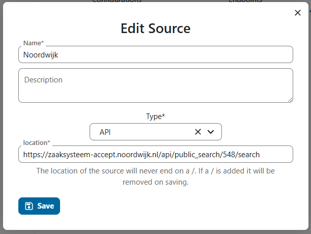

# Source Configuration

## Source

A **Source** represents an external service or system that OpenConnector can interact with. This is typically an API but can also be databases, file servers, or other services. Sources allow the Connector to retrieve, process, and synchronize data.

### Basic setup

To configure a source, you need to define its basic properties:

1. **Name**: A descriptive identifier for the source (e.g., "Noordwijk"). This name will appear in the UI to help you quickly locate the source.
2. **Description**: A brief explanation of the source's purpose or content (optional).
3. **Type**: Defines the type of connection (e.g., API, database, file server).
4. **Location**: The endpoint or base URL of the source (e.g., `https://zaaksysteem.noordwijk.nl/api/v1`).



**Note**: Ensure the location does not end with a `/`. If included, it will be removed during saving.

### Authentication

If the source requires authentication (e.g., an API key, certificate, or OAuth token), these credentials are managed securely in the **Vault**. To authenticate:

1. Add the required authentication details in the Vault.
2. Link the authentication method to the source.

Multiple authentication methods can be associated with a single source, offering flexibility for different connection scenarios.

### Synchronisations

Synchronizations between sources and the system can be managed in the **Synchronizations** tab for each source. This provides an overview of all configured synchronization tasks related to a source.

@todo add screenshots

### Configuration

Sources are called using the **Call Service**, based on the popular [Guzzle library](https://docs.guzzlephp.org/en/stable/). This enables flexible configuration of connection parameters. You can add custom configurations using a **dot.notation** format.

**Example Configuration:**

To set the `Accept` header for API calls:

* **Key**: `headers.Accept`
* **Value**: `application/json`

This creates the following request header:


This configuration will lead to the following configuration on the call service:

```
headers:
  - name: Accept
    value: application/json 
```

Other commonly used options include:

* **Headers**: Define custom request headers.
* **Query**: Add query parameters to requests.

But all [guzzle options](https://docs.guzzlephp.org/en/stable/request-options.html) are supported. So for example, you can change the timeout of the call by adding the following configuration to the source:

`timeout = 10`

## Logging

The Call Service logs all requests and responses for each source. Logs can be viewed directly in the **Logs** tab of the source's detail page.


**Note**: Future updates will allow configuring the log retention period.
