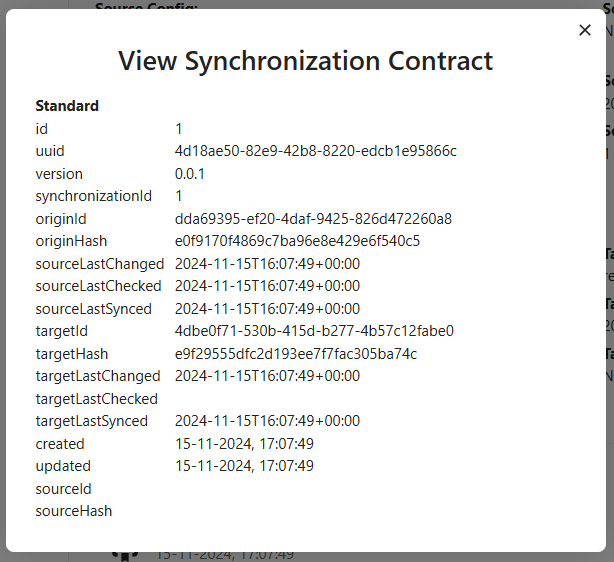
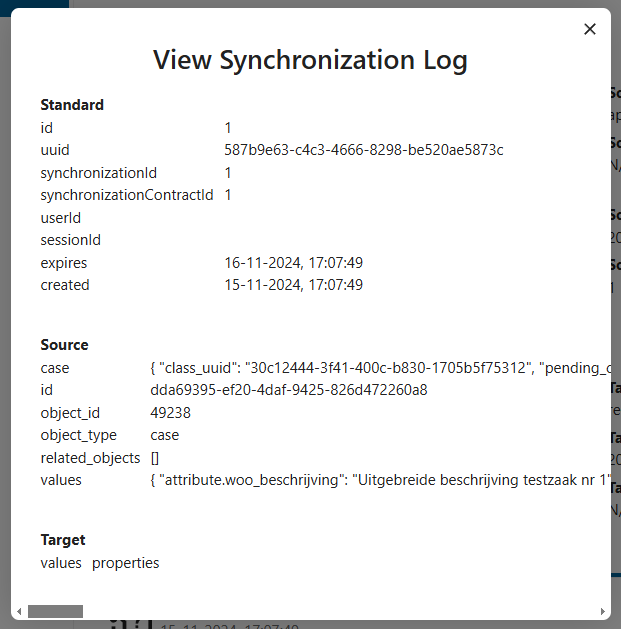

# Synchronysation

Synchronysation describes the process of syncing data from source to target.

* sourceType: The type of the source (api, file, database, register etc.).
* sourceId: The id of the source.
* targetType: The type of the target (api, file, database, register etc.).
* sourceId: The id of the target.

## Configurations

In some cases we need aditional configurations for the synchronysation. E.g. when syncync from an api that contains a collection of data we need to define the property name of the collection (e.g. results or data) and to make sure the synchronysation is done in loop trough the collection items we also need pagination details and a way to get the next page and a place for the id property to make sure that the object is unique.

## Synchronysation flow

The initial step in the synchronization process involves determining the current state of data. There are three main scenarios:

1. The object exists on the target but not on the source: In this case, we need to decide if the object should be deleted from the target or added to the source, based on the specific rules and constraints of the system.
2. The object exists on the source but not on the target: Here, we usually need to add the object to the target to maintain synchronization.
3. The object exists on both the source and target: In this situation, we need to establish which version is newer and update accordingly. There are three sub-scenarios:
   * The target version is newer: The source should be updated with the targets's version.
   * The source version is newer: The target should be updated with the source's version.
   * The versions are the same: No action is required.
   * In instances where we can't establish which version is newer, we must assume which party is "right" and determine a source of truth. Typically, this would be the source, but it can be configured to be the target.

## Contracts

Each time an object is synchronised a contract is created. This contract can be viewed in the UI and will show details about the object. Contracts are used to track changes and updates between the source and target. And determine if the object is in sync or not.  

## Log's

Each time a synchronysation is executed a log is created. This log can be viewed in the UI and will show details about the execution.

 
