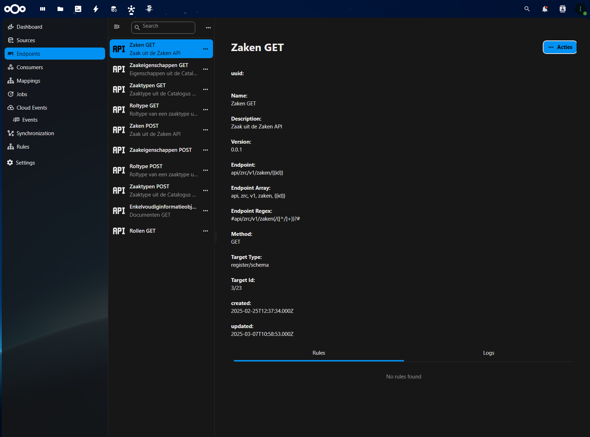

# Endpoints in OpenConnector

Endpoints in OpenConnector allow you to retrieve data from a source, such as an API or an OpenRegister instance. You can apply **mappings** and **rules** to process and manipulate the retrieved data as needed.

---

## Creating an Endpoint

An endpoint requires three key attributes:
- **`endpoint`** – The API path (e.g., `api/v1/zaken`).
- **`targetType`** – Defines the type of data source (`api` or `register/schema`).
- **`targetId`** – The specific source identifier (e.g., `registerId/schemaId`).

### Path Formatting Guidelines
- The `endpoint` **must not start with `/`**, but should begin with the first path segment as text (e.g., `api/v1/zaken`).
- If your endpoint needs to support fetching **a single item**, append `{{id}}` at the end:
  ```plaintext
  api/v1/zaken/{{id}}
  ```
- Each HTTP method (GET, POST, etc.) requires a separate endpoint definition. While the path remains the same, you must create individual entries for each method and clearly label them.

### Using OpenRegister as a Data Source
If the endpoint retrieves data from **OpenRegister**, set:
- **`targetType`** to `register/schema`
- **`targetId`** to the corresponding `registerId/schemaId`.

#### Example: ZGW Zaken Endpoint


---

## Sub Endpoints

For nested API paths, such as:
```plaintext
v1/zaken/{zaak_uuid}/zaakeigenschappen/{eigenschap_uuid}
```

The corresponding endpoint should be defined using placeholders:
```plaintext
v1/zaken/{{id}}/zaakeigenschappen/{{zaakeigenschap_id}}
```

Here, `zaakeigenschap` refers to the **configured schema name** in OpenRegister (converted to lowercase with `_id` appended).

---

## Authorization

Endpoints can either be **publicly accessible** or **secured via JWT authentication**.

### Public Access
By default, endpoints are publicly accessible unless authentication is explicitly enabled.

### JWT Authentication
To enable **JWT-based authentication**, follow these steps:
1. **Create a consumer** in OpenConnector.
2. **Use the consumer name as `clientId`**.
3. **Set the public key as the secret** in the authorization configuration.
4. **Specify the admin username** as the `userId` in the authorization settings.

#### Example: Consumer Configuration


⚠️ **Note:** Authentication settings are automatically applied to all created endpoints and cannot be adjusted per endpoint at this time.

### JWT Authorization in Postman


---

## Conclusion

Endpoints in OpenConnector provide **flexible API integration**, allowing data retrieval from various sources. With **mapping**, **rules**, and **JWT authentication**, you can structure and secure API access as needed. 🚀
