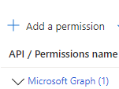
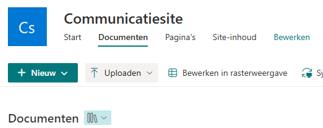
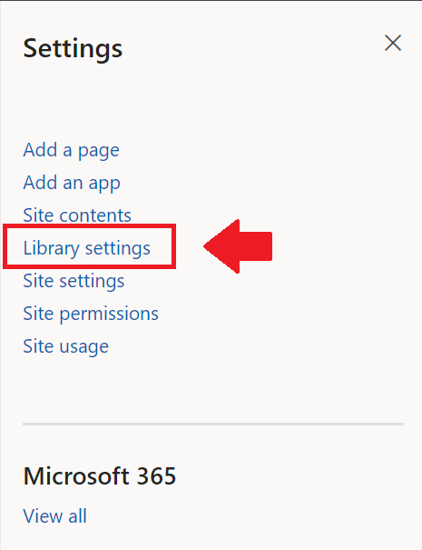

# SharePoint Integration with OpenConnector

SharePoint is Microsoft's document management and collaboration platform that allows organizations to store, organize, share, and access information securely. Many organizations, especially government institutions, use SharePoint to manage their internal documents and workflows.

## Why Connect to SharePoint?

In the context of Open Data and specifically the Dutch WOO (Wet Open Overheid - Open Government Act), organizations need to make certain documents publicly accessible. However, these documents often reside in internal SharePoint environments. OpenConnector provides a seamless solution to bridge this gap.

## Prerequisites
- A Microsoft SharePoint instance managed with Microsoft Entra.
- A Nextcloud instance with OpenConnector installed.
- A valid X.509 certificate and the private key.
- A Linux command line (or Git Bash on Windows) for generating values later in the process.

## Example: WOO Documents Publication Flow

OpenConnector automates the publication of WOO documents from SharePoint to Open Catalogi through the following steps:

1. **Configuring SharePoint Access (Microsoft Entra Setup)**
	- Register an application in Microsoft Entra.
	- Assign API permissions for SharePoint.
	- Upload and configure certificate-based authentication.

2. **Establishing a Connection in OpenConnector**
	- Set up SharePoint as a source in OpenConnector.
	- Define authentication settings and API endpoints.
	- Validate connection through test requests.

3. **Navigating the Folder Structure in SharePoint**
	- OpenConnector scans designated SharePoint folders for WOO documents.
	- Reads metadata and identifies publication-ready content.

4. **Publishing to Open Register**
	- Maps SharePoint metadata to Open Register properties.
	- Assigns WOO classifications, publication dates, and visibility settings.

5. **Synchronizing Documents**
	- Automatically syncs SharePoint documents with OpenCatalogi.
	- Maintains version history and updates files upon changes.

This automated workflow ensures consistent, secure, and compliant publication of WOO documents.

## Configuring SharePoint Access (Microsoft Entra Setup)

### Configuring Microsoft Entra

#### Step 1: Register an Application
1. Navigate to **Identity → Applications → App registrations**.
2. Create a new application and assign a name.

   

#### Step 2: Assign SharePoint API Permissions
1. Under the **API Permissions** tab, click ‘Add permissions’.

   

   

2. Click **Delegated permissions** and enable:
	- `AllSites.Read`

   

3. Select **SharePoint → Application permissions** and enable:
	- `Sites.Read.All`

   

4. Click **Grant admin consent** to finalize.

   

#### Step 3: Upload Certificate for Authentication
1. Go to the **Certificates & secrets** tab.
2. Under **Certificates**, click **Upload certificate**.
3. Upload the public certificate (`.crt` or `.pem`).

   

4. Save the certificate thumbprint for later use.

   

### Configuring a SharePoint Source in OpenConnector

Next, we need to set up the source in OpenConnector.

#### Step 1: Add a Source in OpenConnector
1. Open Nextcloud and navigate to OpenConnector.
2. Click **Sources → Add source**.
3. Provide the name, description, and SharePoint URL (e.g., `https://{tenant}.sharepoint.com/_api`).
4. Set **Type** to API.

   

#### Step 2: Set Up Authentication
1. Navigate to the **Authentication** tab and click **Add Authentication**.
2. Enter the following key-value pairs (italic values can be copied without editing):

| Key                   | Value                                                                                                                                                                                                                                | Note                                                                                                                        |
|-----------------------|--------------------------------------------------------------------------------------------------------------------------------------------------------------------------------------------------------------------------------------|-----------------------------------------------------------------------------------------------------------------------------|
| grant_type            | *client_credentials*                                                                                                                                                                                                                 |                                                                                                                             |
| scope                 | `https://{sharepoint_url}/.default`                                                                                                                                                                                                  | See above for the default URL                                                                                               |
| authentication        | *body*                                                                                                                                                                                                                               |                                                                                                                             |
| client_id             | (The client ID of the app registration)                                                                                                                                                                                              | See [Obtain client ID and tenant ID](#obtain-client-id-and-tenant-id)                                                       |
| client_secret         | (Empty string)                                                                                                                                                                                                                       | Due to OAuth boundaries, this is a mandatory key but should be left empty                                                   |
| client_assertion_type | *urn:ietf:params:oauth:client-assertion-type:jwt-bearer*                                                                                                                                                                             |                                                                                                                             |
| private_key           | (Base64 encoded private key of the certificate)                                                                                                                                                                                      | Highly recommended to use a secret manager for storing the private key                                                      |
| x5t                   | (SHA1 thumbprint of the certificate)                                                                                                                                                                                                 | See [Obtain x5t value](#obtain-x5t-value)                                                                                   |
| payload               | `{"aud": "{tokenUrl}","exp": {{ 'now'\|date_modify('+15 minutes')\|date('U') }},"iss": "{client_id}","jti":"dfdaa67d-d76e-48c4-a349-58861983869e","nbf": {{ 'now'\|date('U') }},"sub": "{client_id}","iat": {{ 'now'\|date('U') }}}` | Replace `{tokenUrl}` with the same value as ‘tokenUrl’ (see below) and `{client_id}` with the client_id (see above)         |
| tokenUrl              | `https://login.microsoftonline.com/{tenant_id}/oauth2/v2.0/token`                                                                                                                                                                    | Replace `{tenant_id}` with your Microsoft Tenant ID (see [Obtain client ID and tenant ID](#obtain-client-id-and-tenant-id)) |

##### <h5 style="font-size: 1.1em; color: gray; border-bottom: 2px solid black; padding-bottom: 5px;">Obtain client ID and tenant ID</h5>
As seen in the table above in step 2 ([Set Up Authentication](#step-2-set-up-authentication)), there are two locations where the client ID has to be inserted into the source, and likewise two locations where the Tenant ID must be inserted (both times in the token URL).

The client ID can be obtained from the Microsoft Entra dashboard by clicking on ‘Overview’ in the App registration, and copying the value ‘Application (client) ID’ in essentials.

The Tenant ID can be found in the same list, as ‘Directory (tenant) ID’.


##### <h5 style="font-size: 1.1em; color: gray; border-bottom: 2px solid black; padding-bottom: 5px;">Obtain x5t value</h5>
The x5t value is an encoded version of the SHA1 thumbprint we obtained in the [Upload Certificate for Authentication](#step-3-upload-certificate-for-authentication) section.
To encode this value we can use the command line.

In a Linux (or Git Bash) command line, use the following command:

```bash
echo '{thumbprint}' | xxd -r -p | base64
```

The resulting string can be entered into the x5t value.

#### Step 3: Configure Headers
Now that we have the authentication values, we can set the configuration fields.
1. Click the tab ‘Configurations’.
2. In the Actions menu select ‘add configuration’ & add these two:
	- `headers.Authorization` → `Bearer {{ oauthToken(source) }}`
	- `headers.Accept` → `application/json;odata=verbose`


#### Step 4: Test the Source
Now we should be done setting up the source.
1. Click **Test** in the Actions menu.
2. Enter the endpoint `/Web/lists` and press 'Test connection'.
3. A successful response (Status: OK (200)), the source is configured correctly.

## Configuring SharePoint for WOO Document Storage

SharePoint can be used as a source for publishing Woo requests and decisions. For this to work SharePoint must be structured appropriately.

### Creating a SharePoint Site

In order to store documents and acces them with api calls you first need to create a site in SharePoint. Follow these steps to create your SharePoint site:

1. **Access SharePoint**: Sign in to your Microsoft 365 account, click the App Launcher (grid icon) in the top-left corner, and select "SharePoint."
2. **Initiate Site Creation**: On the SharePoint homepage, click "+ Create site."
3. **Select a Template**: Choose a Communication Site with a standard template.
4. **Configure Site Details & Finalize Creation**: Enter a name, a description and select a language and click on finish.

Now you have configured a SharePoint site where you can add and manage documents.



### Structure of the Publication Folders

Each publication is represented by a separate folder within the main publication directory. All associated documents and attachments are stored within this folder.

Example API endpoint for retrieving publications: `/_api/Web/GetFolderByServerRelativePath(decodedurl='/WOO/Woo-verzoeken en -besluiten')/folders`

It is recommended to store all publications in one central folder. (you dont have to make separate folders for each Woo category as in the example, just put them all in one big folder)

**Folder structure:**


Each folder within the parent directory represents a single publication:


Where within you can store the documents that belong to this publication.


### Configuring Metadata in SharePoint

To ensure compliance with [OpenWOO](https://openwoo.app/Techniek/Configuratie/), metadata fields must be configured in SharePoint.

1. Open settings.

   

2. Navigate to **Library settings** → **More library settings**.

   
   

3. Navigate to **Enterprise Metadata and Keywords settings**.

   

4. Enable the Enterprise Keywords option and press OK.

	

5. Create a column for each configuration field from [OpenWOO](https://openwoo.app/Techniek/Configuratie/).

   

6. Here you can configure the columns, make sure to enable default view.

   

#### Example of minimal configuration.


#### Example of an extended configuration including all optional fields.


### Modifying publication metadata
To update the metadata of a publication:
1. Open the document library and locate the publication folder.
2. Click **Grid edit** to modify metadata.
3. Save changes by clicking **Exit grid** in the upper-left corner.


## Configuring a SharePoint Synchronization in OpenConnector

Now we can set up the Synchronization in OpenConnector.

### Step 1: Add Synchronization Mapping in OpenConnector

to do

### Step 2: Add a Synchronization in OpenConnector

...connect mapping...

...Publication Schema should be set up correctly (add link to WOO docu for this)...

to do

### Step 3: Set Up SourceConfig

to do

### Step 4: Test the Synchronization

Now we should be done setting up the Synchronization.

1. Click **Test** in the Actions menu.
2. to do
