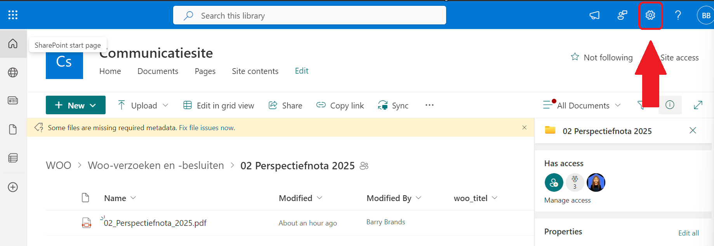
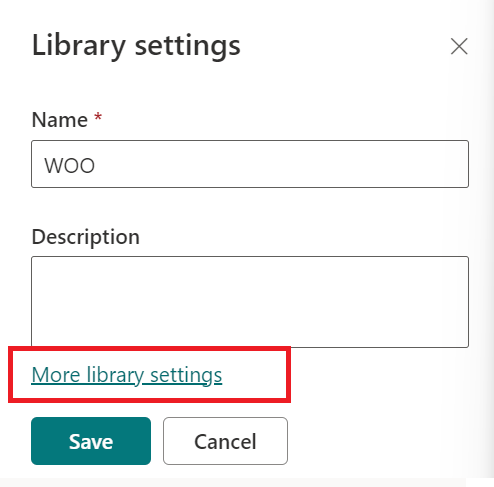
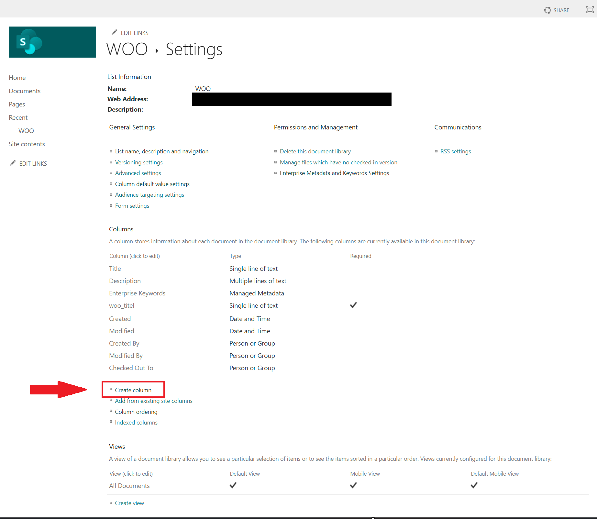

# SharePoint Integration with OpenConnector

SharePoint is Microsoft's document management and collaboration platform that allows organizations to store, organize, share, and access information securely. Many organizations, especially government institutions, use SharePoint to manage their internal documents and workflows.

## Why Connect to SharePoint?

In the context of Open Data and specifically the Dutch WOO (Wet Open Overheid - Open Government Act), organizations need to make certain documents publicly accessible. However, these documents often reside in internal SharePoint environments. OpenConnector provides a seamless solution to bridge this gap.

## Example: WOO Documents Publication Flow

Let's walk through how OpenConnector can automatically publish WOO documents from SharePoint to Open Catalogi:

1. **SharePoint Connection Setup**
   - Configure OpenConnector with your SharePoint endpoint URL
   - Set up certificate-based authentication using your organization's certificates
   - Establish secure connection parameters

2. **Folder Structure Navigation**
   - OpenConnector systematically traverses through SharePoint folders
   - Identifies folders containing WOO documents
   - Reads metadata from folder labels and properties

3. **Publication Creation in Open Register**
   - For each SharePoint folder:
     - Creates a new publication object in Open Register
     - Maps SharePoint folder metadata to publication properties
     - Sets appropriate WOO categories and classifications
     - Establishes publication dates and visibility settings

4. **Document Synchronization**
   - Automatically syncs all documents from SharePoint folders
   - Maintains file integrity and metadata
   - Updates documents when source files change
   - Preserves version history and audit trail

This automated flow ensures that WOO documents are consistently and accurately published while maintaining security and compliance requirements.

## How to configure SharePoint for Woo

SharePoint can be used as a source for publishing Woo requests and decisions. To enable this, a specific folder must be set up where publications are stored. Access to these publications can then be obtained via an endpoint.

### Structure of the Publication Folders

Each publication is represented by a separate folder within the main publication directory. All associated documents and attachments are stored within this folder.

That would result in a API endpoint which can be used retrieve publications: `/_api/Web/GetFolderByServerRelativePath(decodedurl='/WOO/Woo-verzoeken en -besluiten')/folders`
It is recommended to store all publications in one central folder. (you dont have to make separate folders for each Woo category as in the example, just put them all in one big folder)

One folder in the big parent folder represents one publication.

Where within you can store the documents belonging to the publication.

### Configuring Metadata in SharePoint

To properly manage and structure publications, SharePoint must be configured to allow metadata to be added per publication folder. This ensures that publications comply with the requirements of [OpenWOO](https://openwoo.app/Techniek/Configuratie/).

Open settings.

View library settings.

Go to more library settings.

Navigate to Enterprise Metadata and Keywords settings.

Enable the Enterprise Keywords option and press OK.

Create a column for each configuration field from [OpenWOO](https://openwoo.app/Techniek/Configuratie/).

Here you can configure the columns, make sure to enable default view.

Example of minimal configuration.

Example of an extended configuration including all optional fields.

### Modifying publication metadata

To update the metadata of a publication:
1. Open the document library and view the publications folder.
2. Click on Grid edit to enter or modify metadata.
3. After entering the data, click Exit grid in the upper-left corner to save the changes.

